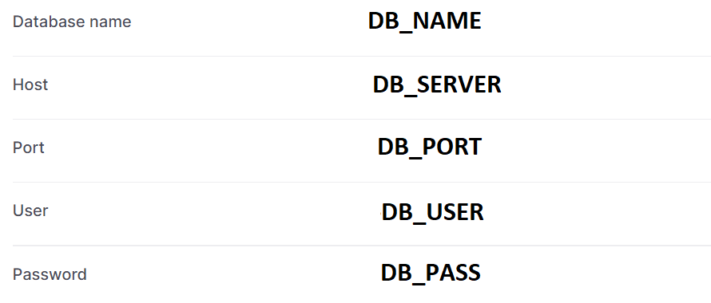
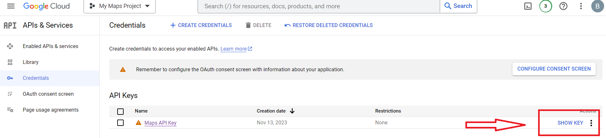

# Skouty

## Local Setup

1. Install [PHP](https://www.php.net/manual/en/install.php). You can use this [guide](https://www.sitepoint.com/how-to-install-php-on-windows/) as a reference.
2. Configure `php.ini`. Uncomment the following extensions:
```
extension=gd2
extension=mbstring
extension=mysqli
extension=pdo_mysql
```
3. Add `C:\php` to your `PATH` environment variable.
4. Install [Composer](https://getcomposer.org/doc/00-intro.md#globally). Then, go to the `/src` folder and run 
```
composer require vlucas/phpdotenv
``` 

5. Install [MySQL](https://dev.mysql.com/doc/mysql-installation-excerpt/5.7/en/). Open MySQL Workbench.
6. Create a database called `skouty`.
7. Go to `User and Privileges` and click `Add account` then create a user with the following details.
```
Login name: webuser
Password: root
Port: 3306
Adminstrative Role: DBA
```
7. Create a [Google Developer account](https://developers.google.com/maps. Go to the Google Maps Platform > Credentials page and generate an API key. You will need billing info, but you won't be charged.
8. Create a `.env` file in `/src/private` with the following (replace MAPS API key with your own):
```
DB_PORT="3306"
DB_SERVER="localhost"
DB_USER="webuser"
DB_PASS="root"
DB_NAME="skouty"
MAPS_API_KEY="<YOUR_MAPS_API_KEY>"
```
7. Open and run `initialize.sql` in MySQL Workbench.
8. Download this repository
9. Open command prompt/terminal in this directory and run `cd src/public`.
10. Run `php -S localhost:8000`. Go to `http://localhost:8000` on your browser to view the website. Make sure you are connected to the Internet to render the website properly.

## Setup with Repl.it and Aiven (Free hosting)
1. Create a PHP webserver [repl.it](https://replit.com/~).
2. Upload the `/src` folder.
3. Go to `/private/credentials.php` and replace every instance of `$_ENV[<name>]` with `getenv('<name>')`;
4. Create a [Google Developer account](https://developers.google.com/maps). Go to the Google Maps Platform > Credentials page and generate an API key. You will need billing info, but you won't be charged.
5. Install [MySQL](https://dev.mysql.com/doc/mysql-installation-excerpt/5.7/en/). Open MySQL Workbench.
6. Create an [Aiven](https://console.aiven.io/signup/email) account and make a MySQL project (Free tier).
7. In the quick connect options, choose MySQL Workbench and follow the instructions.
8. Once you've connected to Aiven from MySQL Workbench, create a database called `skouty`.
9. Open and run `initialize.sql` in MySQL Workbench.
10. Go to repl.it and click on Secrets then Edit as JSON.
11. Paste the following (replace with details from the previous steps):
```
"DB_PORT" : "<AIZEN_PORT>",
"DB_SERVER" : "<AIZEN_SERVER>",
"DB_USER" : "<AIZEN_USERNAME>",
"DB_PASS" : "<AIZEN_PASSWORD>",
"DB_NAME" : "skouty",
"MAPS_API_KEY" : "<MAPS_API_KEY>"
```

Aiven overview


Google Cloud Credentials

12. On the files bar on the left, click on the three dots then Show hidden files.
13. Edit the `.replit` file to the following:
```
run = "cd src/public/ && php -S 0.0.0.0:8000 -t ."

entrypoint = "src/public/index.php"

[nix]
channel = "stable-22_11"

[deployment]

run = ["php", "-S", "0.0.0.0:8000", "-t", "."]
deploymentTarget = "cloudrun"
```
14. Click run! :)
